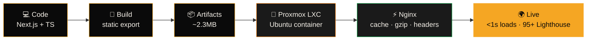

<!-- ╔══════════════════════════════════════════════════════════════════╗
     ║  ARCHISHMAN MITRA — PROFILE v2.0.26                               ║
     ║  congrats, you found the source. you're exactly my kind of nerd.  ║
     ╚══════════════════════════════════════════════════════════════════╝ -->

<div align="center">


[](https://git.io/typing-svg)

<br>

[](https://linkedin.com/in/archishman-mitra)
[](https://linkedin.com/in/archishman-mitra)
[](https://visitcount.itsvg.in)

</div>

<br>

<!-- ═══════════════════════ NEOFETCH ═══════════════════════ -->

```text
                    ▄▄▄▄▄▄▄▄▄▄▄                 archishman@dev-machine
                ▄█████████████████▄             ──────────────────────
              ▄███████████████████▄             OS:        Full-Stack Developer (Student Edition)
             ████▀▀         ▀▀█████             Host:      West Bengal, India 🇮🇳
            ████    ▄▄▄▄▄▄     ████             Kernel:    React 19 + Node.js LTS
            ███   ██▀   ▀██    ████             Uptime:    shipping since day one
            ███   ██  A  ██    ████             Shell:     TypeScript (strict: true, always)
            ████  ▀█▄▄▄▄█▀    ████              Resolution: pixel-perfect or nothing
             ████▄▄        ▄▄████               DE:        Next.js App Router
              ▀███████████████▀                 WM:        Tailwind CSS
                ▀▀█████████▀▀                   Terminal:  Git Bash + Claude Code
                                                CPU:       Caffeine-overclocked
   ████ ████ ████ ████ ████ ████                GPU:       GSAP + Three.js (always rendering)
                                                Memory:    Prisma → PostgreSQL [persistent]
                                                Server:    Proxmox LXC · Nginx · 120MB RAM
                                                Packages:  npm (too many), trust issues (none)
```

<!-- ═══════════════════════ BOOT LOG ═══════════════════════ -->

## `> boot_sequence.log`

```diff
+ [OK] Mounted /dev/fullstack — React, Next.js, Node, Express loaded
+ [OK] Database layer online — PostgreSQL · Prisma · MongoDB · MySQL
+ [OK] Auth module armed — JWT signed & verified
+ [OK] Motion engine hot — GSAP · ScrollTrigger · Lenis · Three.js/R3F
+ [OK] Self-hosted infra detected — Proxmox LXC → Nginx → <1s page loads
! [..] Loading system-design.pkg ............ 67%
! [..] Loading aws-cloud-fundamentals.pkg ... 54%
+ [OK] Status: SEEKING — internships · entry-level roles · freelance · OSS
- [WARN] Cannot stop building things. This is not a bug.
```

<br>

<!-- ═══════════════════════ ABOUT ═══════════════════════ -->

## `> cat about.ts`

```typescript
interface Developer {
  name: string;
  classified: Record<string, unknown>;
}

const archishman: Developer = {
  name: "Archishman Mitra",

  classified: {
    whatIDo: "Build full-stack apps that don't just work — they *feel* good",

    theDifference: [
      "Most students deploy to free tiers. I provisioned my own Linux container.",
      "Most portfolios use templates. Mine scored 95+ on Lighthouse, self-served via Nginx.",
      "Most landing pages are static. Mine have orchestrated GSAP timelines.",
    ],

    currentQuest: {
      learning: ["System Design", "Scalable Backend Architecture", "AWS"],
      grinding: "From 'it works on my machine' → 'it works for 10,000 users'",
    },

    askMeAbout: [
      "REST API design (the kind with actual thought behind it)",
      "Database modeling with Prisma",
      "GSAP scroll choreography & kinetic typography",
      "Next.js static export + self-hosting",
      "Building SaaS products end-to-end",
    ],

    weakness: "Cannot look at a website without inspecting its animations",
  },
};

export default archishman; // open to imports — see LinkedIn 👆
```

<br>

<!-- ═══════════════════════ STACK ═══════════════════════ -->

## `> ls -la /skills`

<div align="center">

### ⚔️ Primary Weapons


### 🗄️ Data Layer


### 🎨 Motion & Visual

<br>


### 🖥️ Infra & Ops

<br>


</div>

<br>

<!-- ═══════════════════════ PIPELINE ═══════════════════════ -->

## `> my deployment pipeline (yes, it's real)`



> **No Vercel. No Netlify. No managed magic.** A container I provisioned, a web server I configured, metrics I can prove: `~120MB RAM at rest · <1% CPU idle · 100+ concurrent users on one box`.

<br>

<!-- ═══════════════════════ PROJECTS ═══════════════════════ -->

## `> ./projects --sort=coolness`

<table>
<tr>
<td width="33%" valign="top" align="center">

### ✍️ SignCraft
  

PDF signing engine — drop a doc with `{{sign1}}` placeholders, map signature images, receive a signed PDF. Wrapped in a landing page that looks like it costs $50k.

`SVG path-draw animations` `magnetic buttons` `custom cursor` `multipart uploads`

</td>
<td width="33%" valign="top" align="center">

### 🖥️ Self-Hosted Portfolio
  

Static-export Next.js served from a Proxmox LXC container I built myself. Production metrics, not vibes.

`120MB RAM` `<1s loads` `95+ Lighthouse` `security headers` `gzip + caching`

</td>
<td width="33%" valign="top" align="center">

### 🏙️ Cinematic Real Estate
  

Awwwards-inspired property showcase. Giant kinetic wordmarks bleeding behind hero imagery, scroll-driven section choreography, hover-reveal accordions.

`SplitText reveals` `Lenis smooth scroll` `R3F scenes` `editorial typography`

</td>
</tr>
</table>

<div align="center">

*↓ more in the pinned repos ↓*

</div>

<br>

<!-- ═══════════════════════ STATS ═══════════════════════ -->

## `> git log --stat --all`

<div align="center">


<br><br>


<br><br>


<br><br>

<!-- 🐍 the snake eats my commits daily — workflow in .github/workflows/snake.yml -->


</div>

<br>

<!-- ═══════════════════════ PHILOSOPHY ═══════════════════════ -->

## `> grep "philosophy" ~/.bashrc`

<div align="center">

```text
╔════════════════════════════════════════════════════════════════╗
║                                                                ║
║   01 │ "It works" is the starting line, not the finish line.   ║
║   02 │ If the animation doesn't direct the eye, delete it.     ║
║   03 │ Own the whole pipeline — code, schema, server, deploy.  ║
║   04 │ Localhost is a rehearsal. Production is the show.       ║
║                                                                ║
╚════════════════════════════════════════════════════════════════╝
```

</div>

<br>

<!-- ═══════════════════════ CONTACT ═══════════════════════ -->

## `> ping archishman`

<div align="center">

**Reply received in: `< 24h`** 📡

Recruiter? Collaborator? Fellow GSAP addict? Someone who also thinks<br>
self-hosting is a personality trait? **My DMs are open.**

<br>

[](https://linkedin.com/in/archishman-mitra)

<br>

⭐ *star a repo if it helped — it genuinely makes my day*


</div>

<!-- ═══════════════════════════════════════════════════════════════
     EOF — you read the whole source? respect.
     now go check the pinned repos, that's where the fun is.
     ═══════════════════════════════════════════════════════════════ -->
